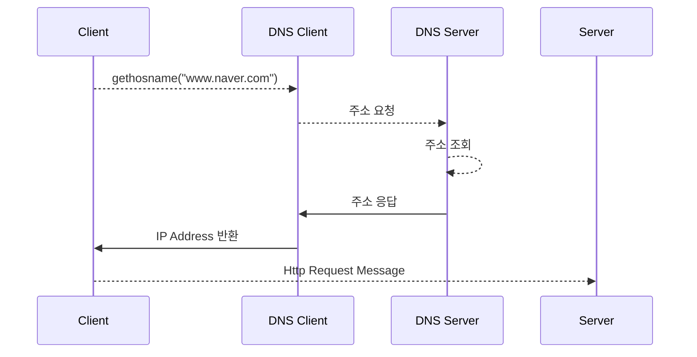
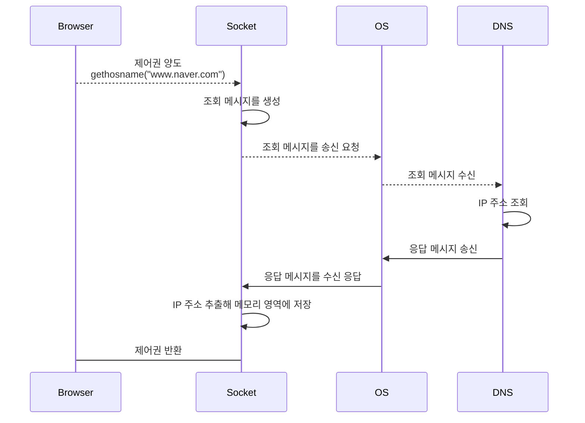

# 웹 서버의 IP 주소를 DNS 서버에 조회한다.

## IP 주소의 기본

1. HTTP 메시지를 만들면 OS에 의뢰해 접근 대상 웹 서버에 전송한다.
2. TCP/IP는 허브에 접속하고 있는 서브넷과 라우터로 네트워크가 구성되어 있다.
3. 네트워크 번호와 호스트 번호를 합쳐 IP 주소라 말한다. IP 주소에 따라 접속 대상의 위치를 판단하고 운반한다. 
    
    
    
    192.168.0이 네트워크 번호가 되고, 39가 호스트 번호가 된다.
    
4. 넷마스크를 이용해 네트워크를 구축할 때, IP 주소의 내역을 사용자가 직접 결정할 수 있다.
    
    
    
    0xffffff00은 Bits로는 24, Dotted Decimal로는 255.255.255.0을 의미한다.
    
5. 호스트번호가 모두 1이면 브로드캐스트를 나타낸다. 
    
    
    
    마지막 호스트 번호가 255이므로 모두 1인 브로드캐스트이다.
    
   >  💡 호스트 번호가 모두 0일 경우, 서브넷 자체를 나타내고, 1일 경우 브로드캐스트를 나타낸다.
    

## 도메인명과 IP 주소를 구분해 사용하는 이유

도메인 명을 주소로 사용하게 되면 기존 32 비트만 사용하는 주소가 255바이트까지 사용하면서 라우터의 부하가 발생해 네트워크의 속도가 느려지기 때문에 실행 효율이 좋지 않다. 그래서 DNS을 적용해 도메인 명으로 검색할 경우 DNS에서 해당 도메인 명의 주소를 검색해준다.

## Socket 라이브러리가 IP 주소를 찾는 기능을 제공한다.

1. 서버는 DNS 리졸버(DNS 클라이언트)에서 네임 리졸루션(IP 주소를 조사하는 행동)을 요청한다. 
2. DNS 리졸버는 소켓 라이브러리로 구현되어 있다.
3. 소켓 라이브러리는 네트워크의 기능을 호출하기 위한 프로그램 부품집이다.

## 리졸버를 이용해 DNS 서버를 조회한다.

리졸버를 호출하면 DNS 서버에 조회 메시지를 보내고 DNS 서버에 IP 주소 정보가 포함된 응답 메시지가 돌아온다. **브라우저가 웹 서버에 메시지를 보낼 때에는 메모리 영역에서 IP 주소를 추출해 HTTP 리퀘스트 메시지와 함께 OS에 건네줘 송신을 의뢰한다.**

## 리졸버 내부 작동

> 💡 OS의 동작은 Sync이고, Blocking이다.

브라우저가 리졸버를 호출하면 제어가 리졸버의 내부로 넘어가게 된다. 즉, 동기화가 발생해 DNS에서 응답이 오지 않는 이상 브라우저는 동작이 일시적으로 정지하게 된다.

이 때, 메시지 송신 동작은 리졸버가 스스로 실행하는 것이 아닌 OS 내부에 포함된 프로토콜 스택을 호출해 실행을 의뢰한다.

### 컴퓨터에서 DNS 서버 설정

DNS 서버의 IP 주소는 TCP/IP 설정 항목이므로 컴퓨터에 미리 설정되어 있고, 리졸버는 해당 정보를 통해 DNS 서버의 IP 주소에 조회 메시지를 송신한다.

