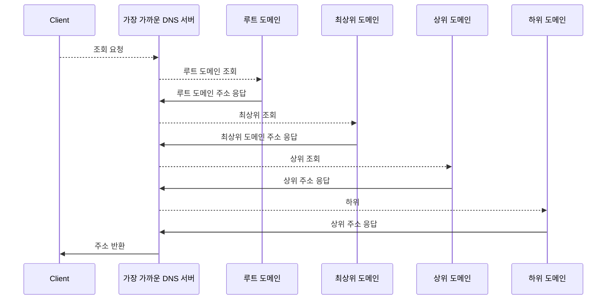

# 전 세계의 DNS 서버가 연대한다.

## DNS 서버의 기본 동작

DNS 서버의 기본 동작은 클라이언트에서 조회 메시지를 받고, 조회의 내용에 응답하는 형태로 정보를 회답하는 일이다.

1. 조회 메시지에는 이름과 클래스, 타입의 정보가 포함되어 있다.
    1. 이름은 서버나 메일 배송 목적지와 같은 이름이다.
    2. 클래스는 DNS 구조를 고안한 인터넷 외의 네트워크에서의 이용까지 검토하고 식별하기 위한 정보이다. **그러나 지금은 인터넷 외 네트워크는 소멸되었기 때문에 클래스는 항상 인터넷을 나타내는 IN 값을 가진다.**
    3. 타입은 이름에 어떤 정보가 지원되는지를 나타낸다. **이 타입에 따라 클라이언트에 회답하는 정보가 달라진다.**
2. DNS 서버는 등록된 도메인명과 IP 주소의 대응표를 조사해 IP 주소를 회답한다.
    
    > 💡 DNS 서버 설정 파일의 1행을 리소스 레코드라 한다.
    
    
3. 메일 타입 같은 경우에는 메일 서버의 우선 순위와 메일 서버의 이름 두 항목이 등록되어 있다.메일 배송 목적지로 복수의 메일 서버가 등록되어 있을 때, 어느 메일 서버를 우선할지 판단하는 지표이다. 적은 값이 우선 선택된다.

## 도메인의 계층

DNS 서버 한 대에 모든 도메인 이름을 저장할 수 없어서 정보를 분산시킨 다수의 DNS 서버를 이용한다. 다수의 DNS 서버는 서로 연대하여 어디에 정보가 등록되어 있는지 찾도록 도와준다.

DNS 서버에 등록한 도메인명은 계층적 구조 형태를 가진다. 인터넷의 도메인은 도메인의 하위 도메인을 만들고 국가나 회사 및 단체 등에 할당한 것이다. 예로 대한민국의 할당된 도메인은 kr이고, 국내의 회사를 나타내는 하위 도메인은 co 형태이다. 이렇게 계층적 구조로 도메인을 관리하고, 쉽게 조회할 수 있다. 

## 담당 DNS 서버를 찾아 IP 주소를 가져온다.

접속 대상의 웹 서버가 어느 DNS 서버에 등록되어 있는지 찾는 방법

1. 하위 도메인을 담당하는 DNS 서버의 IP 주소를 상위 DNS 서버에 등록한다.
2. 상위 DNS 서버를 한 단계 더 상위인 DNS 서버에 등록하는 식으로 차례대로 등록한다.
3. com과 kr같은 최상위 도메인보다 한 단계 더 높은 루트 도메인에서부터 조회하기 시작한다.

클라이언트에서 조회 메시지를 받은 DNS는 아래와 같이 동작해 IP 주소를 조사해 클라이언트에 회답해 IP 주소에 접근한다.

## DNS 서버는 캐시 기능으로 빠르게 회답할 수 있다.

위 동작은 캐싱을 고려하지 않은 동작이다. DNS 서버는 한 번 조사한 이름을 캐싱해 메모리에서 회답해 루트 도메인 부터 검색하지 않는다. 조회한 이름이 도메인에 등록되어 있지 않은 경우에는 이름이 존재하지 않는다는 회답이 돌아오고, 클라이언트는 해당 정보를 캐싱한다.

캐싱할 때의 주의점은 캐시에 정보를 저장 후, 등록 정보가 변경되는 경우도 있으므로, 캐시 안에 저장된 정보는  올바르다고 단언할 수 없으므로, DNS 서버에 등록하는 정보에 유효 기간을 설정해 갱신을 진행하고, 조회에 회답할 때, 캐싱한 정보인지 서버에서 조회한 정보인지에 대한 정보를 포함해 클라이언트가 판단할 수 있도록 설정해야 한다.
