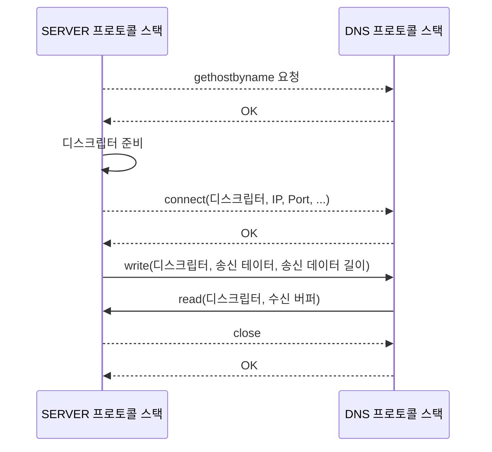

# 프로토콜 스택에 메시지 송신을 의뢰한다.

## 데이터 송, 수신 동작의 개요

데이터를 송수신하기 위해서는 IP 주소를 조사하고 나면 접속 대상 웹 서버에 메시지를 송신하도록 OS 내부에 있는 프로토콜 스택에 의뢰해야한다. DNS 서버도 마찬가지로 주소 조회 기능 동작이 Socket 라이브러리를 이용해 동작한다.

> 💡 OS 내부의 프로토콜 스택에 메시지 송신 동작을 의뢰할 때는 Socket 라이브러리 프로그램 부품을 결정된 순번대로 호출한다.

아래 동작을 실행하는 것은 OS 내부의 프로토콜 스택이다. 애플리케이션은 프로토콜 스택에 의뢰해 파이프를 연결하고 데이터를 넘긴다.

### 소켓 라이브러리를 이용한 데이터 송수신 동작

1. 데이터를 송신하기 위해 소켓을 생성한다.
2. 서버측 소켓에 파이프 연결을 요청한다.
3. 서버에서 소켓을 생성해 연결을 진행한다.
4. 데이터를 송수신한다.
5. 파이프를 분리하고 소켓을 말소한다.

> 💡 소켓은 프로토콜 스택에 데이터를 전달하는 파이프라인일 뿐 실질적인 작업을 하지 않는다.

## 소켓을 이용한 통신

데이터 송수신은 프로토콜 스택에서 소켓 라이브러리를 이용해 통신한다. **여기서 주의깊게 살펴야하는 내용은 소켓 내부에서 제어권이 이동한다는 점이다. 요청을 하면 요청에 대한 응답이 오지 않으면 제어권이 넘어오지 않는다.**

## 소켓의 작성 단계

소켓이 생성되어 파이프라인이 연결되면 디스크립터를 응답받는다. 

## 파이프를 연결하는 접속 단계 - connect

connect를 호출하면서 디스크립터, 소버 IP 주소, 포트 번호를 넘긴다.

> 💡 디스크립터는 애플리케이션만이 소켓을 식별할 수 있는 식별 번호이기 때문에 IP 주소와 포트번호를 통해 서버측에 알려야 한다.

## 메시지를 주고받는 송, 수신 단계 - write, read

### HTTP 리퀘스트 메시지를 송신한다.

write 명령어를 호출할 때 디스크립터와 송신 데이터를 전달하면 프로토콜 스택이 송신 데이터를 서버측에 송신한다. 소켓에는 연결된 상대가 기록되어 있으므로 디스크립터로 송신하려는 소켓의 위치로 데이터를 전달하게 된다.

### HTTP 리스폰스 메시지를 수신한다

수신할 때에는 소켓 라이브러리의 read 명령어를 통해 프로토콜 스택에 수신 동작을 의뢰한다. 이 때, read 명령어로 받은 결과값을 수신 버퍼에 저장한다. 그리고 수신 버퍼에 메시지를 저장한 시점에 메시지를 애플리케이션에 전달한다.

## 연결 끊기 단계에서 송,수신이 종료된다. - close

데이터 수긴을 완료하면 송수신 동작이 끝나게 된다. 그 후, 소켓 라이브러리의 close 명령어를 통해 연결을 끊어야 한다. **그러면 소켓 사이를 연결한 파이프라인이 분리되고, 소켓도 말소된다.**

서버나 클라이언트 둘 중 아무나 연결을 끊어도 문제가 발생하지 않지만, 보통 웹 서버측에서 연결 끊기 동작을 먼저 실행한다.

> 💡 HTTP의 기본 동작은 데이터 하나하나를 별도로 취급해 하나의 데이터를 읽을 때마다 접속, 송수신, 연결 종료 동작을 반복한다. (최근 이러한 오버헤드를 줄이기 위해 복수로 진행한다.)

